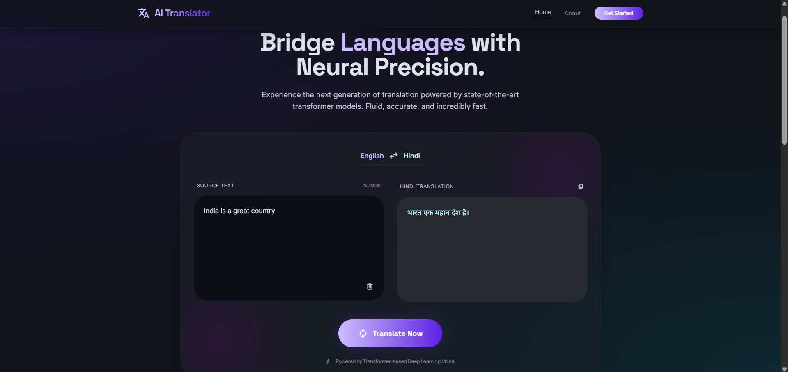

# 🔤➡️🔤 English → Hindi Neural Machine Translator

> Built a Transformer from scratch. No HuggingFace shortcuts. Just math, pain, and a L4 GPU at 2am.

[](https://github.com/ershavait/en-hi-translator-transformer)
[](https://drive.google.com/drive/folders/1X-k8_PB3zi18dzfx4h2-F6KzWE8gITYd?usp=sharing)
[](https://arxiv.org/abs/1706.03762)

---

## Demo



> "India is a great country" → "भारत एक महान देश है।"

---

## What is this

A full encoder-decoder Transformer for English→Hindi translation, trained from scratch on the IITB English-Hindi dataset. Every component — multi-head attention, positional encoding, the whole thing — written in raw PyTorch. No pretrained models, no shortcuts.

Trained for 20 epochs on Lightning AI with a T4 GPU. 787 MB of weights sitting on Google Drive because GitHub said no.

---

## How it actually works

```
"Hello, how are you?"
        ↓
   SentencePiece BPE tokenizer (16K vocab)
        ↓
   [SOS] [tok1] [tok2] ... [EOS] [PAD PAD PAD]
        ↓
   ┌─────────────────────────────┐
   │         ENCODER (×6)        │
   │  Multi-Head Self-Attention  │
   │  + Feed Forward (ReLU)      │
   │  + Residual + LayerNorm     │
   └──────────────┬──────────────┘
                  │ encoder output
   ┌──────────────▼──────────────┐
   │         DECODER (×6)        │
   │  Masked Self-Attention      │
   │  Cross-Attention ← encoder  │
   │  + Feed Forward             │
   └──────────────┬──────────────┘
                  ↓
           Projection → softmax
                  ↓
         greedy decode token by token
                  ↓
        "नमस्ते, आप कैसे हैं?"
```

The decoder generates one token at a time, each time attending back to the full encoder output. Classic autoregressive greedy decoding.

---

## Project structure

```
en-hi-translator-transformer/
├── model.py              # The whole Transformer: encoder, decoder, attention, PE
├── dataset.py            # BilingualDataset, causal mask, padding logic
├── train.py              # Training loop, validation, BLEU/CER/WER logging
├── inference.py          # Translate function + auto GDrive weight download
├── api_server.py         # Flask REST API (port 5000)
├── config.py             # All hyperparams in one place
├── tokenizer_en.model    # SentencePiece English BPE tokenizer
├── tokenizer_hi.model    # SentencePiece Hindi BPE tokenizer
└── frontend/             # HTML/CSS/JS UI that hits the Flask API
    ├── index.html
    ├── index.css
    └── main.js
```

---

## Setup

```bash
git clone https://github.com/ershavait/en-hi-translator-transformer
cd en-hi-translator-transformer
pip install -r requirements.txt
```

The 787 MB weights download **automatically** on first run from Google Drive. You don't touch anything.

> Need ~1 GB free disk space. The weights land in `cfilt/iitb-english-hindi_weights/`.

---

## Run it

```bash
python api_server.py
```

First run: downloads weights → loads model → starts Flask on port 5000.  
Every run after: skips download, loads instantly.

Then open `frontend/index.html` in your browser.

---

## Model weights

Too big for GitHub (787 MB), hosted on Google Drive:

**[⬇️ Download tmodel_19.pt](https://drive.google.com/drive/folders/1X-k8_PB3zi18dzfx4h2-F6KzWE8gITYd?usp=sharing)**

`inference.py` handles the download automatically via `gdown`. If you want to place it manually, drop `tmodel_19.pt` into `cfilt/iitb-english-hindi_weights/`.

---

## Training config

| What | Value |
|---|---|
| Architecture | Encoder-Decoder Transformer |
| Layers | 6 encoder + 6 decoder |
| Attention heads | 8 |
| d_model | 512 |
| d_ff | 2048 |
| Vocab size | 16,000 BPE tokens |
| Max seq length | 150 tokens |
| Dataset | IITB English-Hindi (5% sample ≈ 330K pairs) |
| Epochs | 20 |
| Batch size | 32 |
| Optimizer | Adam (lr=1e-4, eps=1e-9) |
| Loss | CrossEntropy + label smoothing 0.1 |
| Hardware | Lightning AI T4 GPU |

---

## API

**POST** `/api/translate`
```json
{ "text": "The train leaves at six." }
```
```json
{
  "source": "The train leaves at six.",
  "translation": "ट्रेन छह बजे निकलती है।",
  "time_ms": 287
}
```

**GET** `/api/health` — check if model is loaded and which device it's on.

---

## Reference

Vaswani, A., Shazeer, N., Parmar, N., Uszkoreit, J., Jones, L., Gomez, A. N., Kaiser, Ł., & Polosukhin, I. (2017). **Attention Is All You Need**. *Advances in Neural Information Processing Systems*, 30.

The paper that started it all. Every architectural decision in this repo traces back to it.

🔗 [https://arxiv.org/abs/1706.03762](https://arxiv.org/abs/1706.03762)
